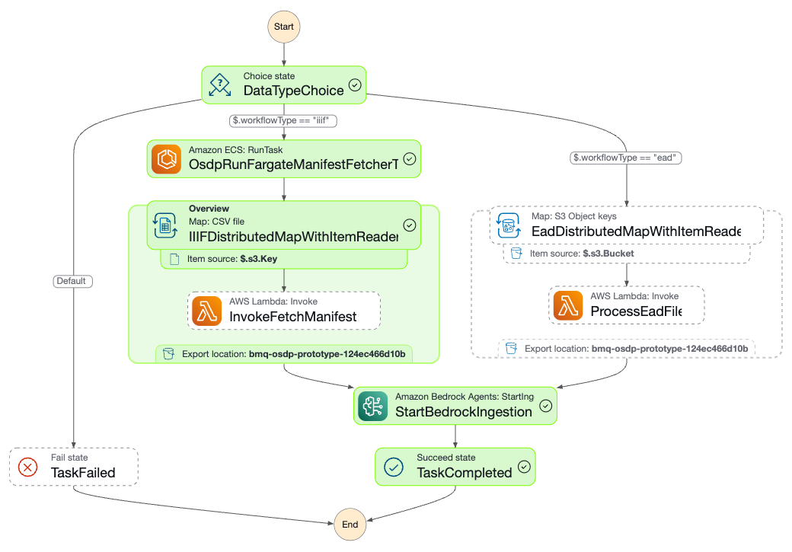

# Treetop Discovery

Treetop Discovery is an AWS CDK-based data discovery platform that builds searchable knowledge bases from IIIF (International Image Interoperability Framework) manifests and EAD (Encoded Archival Description) files using Amazon Bedrock.

## Quick Start for Simple Deployment

### AWS Requirements

- **AWS Account**: Administrator permissions recommended
- **AWS Regions**: Deploy in a region where Amazon Bedrock is available (e.g., us-east-1, us-west-2)
- **Bedrock Model Access**: Enable access to embedding and foundation models in the Bedrock console

### Prerequisites

Install these tools on your local machine:

- `uv` ([installation instructions](https://github.com/astral-sh/uv))
- `aws` cli ([installation instructions](https://docs.aws.amazon.com/cli/latest/userguide/getting-started-install.html)) 
- AWS CDK cli ([installation instructions](https://docs.aws.amazon.com/cdk/v2/guide/getting_started.html))
- AWS CLI configured with your credentials (`aws configure`)

> [!NOTE]
> If you don't have `uv` installed, see [alternate Python setup](#alternative-python-setup-without-uv) below.

### Step 1: Install Dependencies

```bash
# Clone the repository and navigate to it
git clone https://github.com/nulib/treetop-discovery.git
cd treetop-discovery

# Install Python dependencies
uv sync --all-groups

# Activate virtual environment
source .venv/bin/activate

# Verify CDK can build (while in project root)
cd osdp && cdk synth && cd ..
```

> [!IMPORTANT]
> If CDK cannot locate Python dependencies, restart your shell and re-activate the virtual environment.

### Step 2: Configuration

> [!IMPORTANT]
> **Choose Your Data Source Type First**: Treetop Discovery supports two data source types - **IIIF** or **EAD**. You must choose one during initial deployment. Additional data sources can be added later.

Create your configuration file:

```bash
cp osdp/config.toml.example osdp/config.toml
```

**For IIIF Data Sources** (digital collections with IIIF manifests):

```toml
stack_prefix = "my-treetop"  # Choose your stack name prefix

# Recommended: Cross-region inference profiles (replace 123456789012 with your account ID)
embedding_model_arn = "arn:aws:bedrock:us-east-1::foundation-model/cohere.embed-multilingual-v3"
foundation_model_arn = "arn:aws:bedrock:us-east-1:123456789012:inference-profile/us.anthropic.claude-3-5-sonnet-20241022-v2:0"

[data]
type = "iiif"
collection_url = "https://your-iiif-collection-api-url"

[tags]
project = "my-project"

# ECR configuration (optional - defaults shown below)
# Uncomment and modify only if you need to override defaults
# [ecr]
# registry = "public.ecr.aws"                    # Default
# repository = "nulib-staging/osdp-iiif-fetcher" # Default
# tag = "latest"                                 # Default
```

**For EAD Data Sources** (archival XML files in S3):

```toml
stack_prefix = "my-treetop"  # Choose your stack name prefix

# Recommended: Cross-region inference profiles (replace 123456789012 with your account ID)
embedding_model_arn = "arn:aws:bedrock:us-east-1::foundation-model/cohere.embed-multilingual-v3"
foundation_model_arn = "arn:aws:bedrock:us-east-1:123456789012:inference-profile/us.anthropic.claude-3-5-sonnet-20241022-v2:0"

[data]
type = "ead"

[data.s3]
bucket = "your-s3-bucket-name"
prefix = "path/to/ead/files/"

[tags]
project = "my-project"

# Note: ECR section not required for EAD workflows
```

**Required Configuration Changes:**
- `stack_prefix`: Choose a unique name for your deployment (e.g., "my-treetop")
- **Account ID**: Replace `123456789012` in the foundation model ARN with your AWS account ID
- `collection_url` (IIIF only): Your institution's IIIF collection API endpoint
- `bucket` & `prefix` (EAD only): S3 location where your EAD XML files are stored

**Get Your AWS Account ID:**
```bash
aws sts get-caller-identity --query Account --output text
```


**Data Source Requirements:**
- **IIIF**: Your collection must expose a IIIF Collection API endpoint that lists manifest URLs
- **EAD**: Your EAD XML files must be uploaded to S3 before deployment

#### EAD File Preparation

If you chose EAD as your data source, you need to prepare your files before deployment:

1. **Create S3 Bucket** (if you don't have one):
   ```bash
   # Note: S3 bucket names must be lowercase and globally unique
   aws s3 mb s3://your-ead-bucket-name
   ```

2. **Upload EAD XML Files**:
   ```bash
   # Upload individual files
   aws s3 cp your-file.xml s3://your-ead-bucket-name/ead-files/
   
   # Upload entire directory
   aws s3 sync ./local-ead-directory/ s3://your-ead-bucket-name/ead-files/
   ```

3. **Update Configuration**: Ensure your `config.toml` reflects the S3 location:
   ```toml
   [data.s3]
   bucket = "your-ead-bucket-name"  # Must be lowercase
   prefix = "ead-files/"
   ```

> [!IMPORTANT]
> **S3 Bucket Naming**: Bucket names must be lowercase, contain no underscores, and be globally unique across all AWS accounts.

#### Finding Model ARNs

**Enable Model Access:**
Follow the [AWS documentation to enable model access](https://docs.aws.amazon.com/bedrock/latest/userguide/model-access-modify.html). You'll need to enable access to:
- **Embedding models**: Amazon Titan Embed Text, Cohere Embed, or other embedding models
- **Foundation models**: Anthropic Claude, Amazon Titan Text, or other text generation models

**Get Model ARNs:**
After enabling access, you can find ARNs using:

```bash
# List available embedding models
aws bedrock list-foundation-models --by-output-modality EMBEDDING

# List available text generation models  
aws bedrock list-foundation-models --by-output-modality TEXT

# List available inference profiles (recommended for better performance)
aws bedrock list-inference-profiles
```

**ARN Format Options:**

You can use either **direct model ARNs** or **inference profile ARNs** (recommended):

**Direct Model ARNs** (single region):
- Format: `arn:aws:bedrock:REGION::foundation-model/MODEL_ID`
- Example: `arn:aws:bedrock:us-east-1::foundation-model/amazon.titan-embed-text-v1`

**Inference Profile ARNs** (cross-region, recommended):
- Format: `arn:aws:bedrock:REGION:ACCOUNT_ID:inference-profile/PROFILE_ID`
- Example: `arn:aws:bedrock:us-east-1:123456789012:inference-profile/us.anthropic.claude-3-5-sonnet-20241022-v2:0`
- **Benefits**: Higher throughput, automatic optimal region selection, better availability

**Common Model ARNs by Region:**

*Direct Model ARNs:*
- **US East 1**: 
  - Embedding: `arn:aws:bedrock:us-east-1::foundation-model/amazon.titan-embed-text-v1`
  - Foundation: `arn:aws:bedrock:us-east-1::foundation-model/anthropic.claude-v2`
- **US West 2**:
  - Embedding: `arn:aws:bedrock:us-west-2::foundation-model/amazon.titan-embed-text-v1`  
  - Foundation: `arn:aws:bedrock:us-west-2::foundation-model/anthropic.claude-v2`

*Cross-Region Inference Profile ARNs (replace 123456789012 with your AWS account ID):*
- **US Regions**: 
  - Foundation: `arn:aws:bedrock:us-east-1:123456789012:inference-profile/us.anthropic.claude-3-5-sonnet-20241022-v2:0`
  - Embedding: `arn:aws:bedrock:us-east-1::foundation-model/cohere.embed-multilingual-v3`
  - Alternative Foundation: `arn:aws:bedrock:us-east-1:123456789012:inference-profile/us.anthropic.claude-3-7-sonnet-20250219-v1:0`
  - Alternative Embedding: `arn:aws:bedrock:us-east-1::foundation-model/amazon.titan-embed-text-v2:0`

> [!TIP]
> **Use Inference Profiles for Production**: Inference profiles provide [cross-region inference](https://docs.aws.amazon.com/bedrock/latest/userguide/cross-region-inference.html) for better performance and availability. They automatically route requests to optimal regions within your geography.

### Step 3: Deploy

```bash
# Navigate to CDK directory
cd osdp

# Activate virtual environment
source ../.venv/bin/activate

# Bootstrap CDK (required for first-time deployment in region)
cdk bootstrap

# List available stacks to confirm name
cdk ls
# Output will show: my-treetop-OSDP-Prototype

# Deploy the stack (bypass approval prompts for automated deployment)
cdk deploy my-treetop-OSDP-Prototype --require-approval never
```

> [!NOTE]
> **First-time Setup**: The `cdk bootstrap` command is required only once per AWS account/region combination. It creates necessary S3 buckets and IAM roles for CDK deployments.


### Step 4: Monitor Deployment

CDK will deploy approximately 15-20 AWS resources including databases, compute services, storage, and AI/ML components. The deployment typically takes 10-15 minutes.

> [!WARNING]
> **Post-Deployment Data Loading**: After CDK deployment completes, the application will show CORS errors and be unusable until the initial data ingestion finishes. This process can take **several hours** depending on your collection size. Monitor progress using the steps below.

**Required AWS Permissions:**
This deployment requires Administrator permissions or a custom policy with extensive permissions across S3, RDS, Lambda, Step Functions, Bedrock, Cognito, API Gateway, Amplify, ECS, and IAM.

**AWS Credentials Setup:**
- Ensure your AWS CLI is configured with valid credentials (`aws configure` or AWS SSO)
- For AWS SSO users: Refresh credentials if you get "invalid security token" errors (if you need help, see [Northwestern University Development](#nu-development-environment))
- The deployment process can take 15-30 minutes, so ensure your session won't expire mid-deployment

#### CloudFormation Stack Outputs

After deployment completes check the bottom for relevant stack outputs (if you miss them, just go to: AWS Console → CloudFormation → Your Stack → Outputs tab):

- `Website URL`: Your Amplify application URL 
- `ApiUrl`: Your API Gateway endpoint URL
- `UserPoolId`: Cognito User Pool ID (needed for creating users)
- `KnowledgeBaseId`: Bedrock Knowledge Base ID

> [!TIP]
> Save the `UserPoolId` and `UserPoolIdWebsite URL` from outputs. You'll need the `UserPoolId` to create Cognito users in the next step. `Website URL` is your application URL which can be retrieved manually by following step 6 below.

### Step 5: Create User Account

Before accessing the UI, create Cognito users using the `UserPoolId` from your stack outputs:

1. **Via AWS Console**:
   - Go to Amazon Cognito → User Pools
   - Select your pool (named `<stack-prefix>-user-pool`)
   - Click "Create user"
   - Set username, temporary password, and email
   - User must change password on first login

2. **Via CLI** (using UserPoolId from stack outputs):
   ```bash
   aws cognito-idp admin-create-user \
     --user-pool-id <UserPoolId-from-stack-outputs> \
     --username john.doe \
     --user-attributes Name=email,Value=john@example.com \
     --temporary-password TempPass123! \
     --message-action SUPPRESS
   ```

### Step 6: Locate and Test Your Application

Your application URL is available in the stack outputs as `Website URL`. If you need to find it manually:

1. **Via AWS Console**: Go to AWS Amplify → Apps → `<your-prefix>-ui-<suffix>` → View App
2. **Via CLI**: 
   ```bash
   aws amplify list-apps --query 'apps[?contains(name,`my-treetop-ui`)].{Name:name,Domain:defaultDomain}' --output table
   ```

The URL format is: `https://main.<app-id>.amplifyapp.com`

**Testing Access:**
- Navigate to your application URL
- Log in with the Cognito user credentials you created
- The chat interface should be available once data loading completes

### Step 7: Load Additional Data

After your initial deployment, you can load additional datasets by manually invoking the Step Function:

**For Additional IIIF Collections:**
1. Go to AWS Console → Step Functions
2. Select your state machine: `<stack-prefix>-data-pipeline`
3. Click "Start execution"
4. Use this JSON input (replace bucket name with your **Data Processing Bucket** - see [Finding Your S3 Buckets](#finding-your-s3-buckets) below):
```json
{
  "s3": {
    "Bucket": "your-s3-bucket-name",
    "Key": "manifests.csv"
  },
  "workflowType": "iiif",
  "collection_url": "https://your-new-collection-api-url"
}
```

**For Additional EAD Files:**
1. Upload your EAD XML files to your S3 bucket
2. Go to AWS Console → Step Functions  
3. Select your state machine: `<stack-prefix>-data-pipeline`
4. Click "Start execution"
5. Use this JSON input (replace bucket name with your **Data Processing Bucket** - see [Finding Your S3 Buckets](#finding-your-s3-buckets) below):
```json
{
  "s3": {
    "Bucket": "your-s3-bucket-name", 
    "Prefix": "path/to/new/ead/files/"
  },
  "workflowType": "ead"
}
```

> [!NOTE]
> To load EAD data after initially deploying with IIIF, you must grant S3 `GetObject` and `ListObjects` permissions to both the state machine and EAD processing Lambda function.

#### Finding Your S3 Buckets

Your deployment creates **two S3 buckets**:

1. **Config/Source Bucket**: Stores your original EAD XML files (named from your `config.toml` - e.g., `my-treetop-ead-bucket`)
2. **Data Processing Bucket**: Stores processed data and results (auto-generated name with random suffix - e.g., `my-treetop-12345678abcd`)

**For Step Function workflows, you need the Data Processing Bucket name:**

**Method 1 - CloudFormation Outputs:**
1. AWS Console → CloudFormation → Your stack → Outputs tab
2. Look for output with key containing "bucket" or "s3"

**Method 2 - S3 Console:**
1. AWS Console → S3 → Buckets
2. Look for bucket name starting with `<stack-prefix>-` and ending with random characters
3. Example: `my-treetop-12345678abcd` (**this is your Data Processing Bucket**)
4. Your Config/Source Bucket will match your `config.toml` bucket name exactly

**Method 3 - AWS CLI:**
```bash
# List buckets containing your stack prefix
aws s3 ls | grep my-treetop

# You'll see both buckets:
# my-treetop-ead-bucket          <- Config/Source Bucket  
# my-treetop-12345678abcd        <- Data Processing Bucket (use this for Step Functions)
```

### Monitoring Data Loading Progress

**Initial data loading takes hours and the UI shows CORS errors until complete.**

#### Step-by-Step Monitoring

**1. Check Step Function Execution:**
- AWS Console → Step Functions → `<stack-prefix>-data-pipeline`
- Look for "RUNNING" or "SUCCEEDED" status
- If failed, click execution to see error details
- Expected runtime: 1-4 hours depending on collection size

**2. Monitor Bedrock Knowledge Base Sync:**
- AWS Console → Amazon Bedrock → Knowledge bases
- Select your knowledge base (named `<stack-prefix>-knowledge-base`)
- Click "Data source" tab → View sync jobs
- Wait for sync status to change from "Syncing" to "Ready"

**3. Verify Data Processing:**
- AWS Console → S3 → Your **Data Processing Bucket** (the one with random suffix - see [Finding Your S3 Buckets](#finding-your-s3-buckets))
- Check for processed files in `data/ead/` folder (EAD workflows) or `data/iiif/` folder (IIIF workflows)
- Files should appear as Step Function progresses
- Note: Your original EAD files remain in the Config/Source Bucket unchanged

**4. Check for Errors:**
- AWS Console → CloudWatch → Log groups
- Look for logs from Lambda functions:
  - `/aws/lambda/<stack-prefix>-get-iiif-manifest` (IIIF only)
  - `/aws/lambda/<stack-prefix>-process-ead` (EAD only)

#### Expected Timeline
- **Step Function**: 1-4 hours (varies by collection size)
- **Bedrock Sync**: Additional 30-60 minutes after Step Function completes
- **UI Access**: Available once Bedrock sync shows "Ready" status

#### Troubleshooting Data Loading
- **Step Function fails**: Check CloudWatch logs for specific Lambda errors
- **Bedrock sync stuck**: Verify S3 permissions and file formats
- **UI still shows CORS errors**: Bedrock sync may still be in progress
- **No data in S3**: Check your source data configuration (collection URL or S3 path)

---

## Advanced Topics

### Architecture



Treetop Discovery uses AWS CDK (Cloud Development Kit) to define and deploy cloud infrastructure as code. The CDK application creates the following AWS resources:

**Core Infrastructure:**
- S3 bucket for data storage
- RDS Aurora PostgreSQL cluster for vector storage
- VPC with subnets and security groups

**Data Processing:**
- Step Functions state machine for data ingestion
- Lambda functions for IIIF/EAD processing
- ECS tasks for IIIF manifest fetching (IIIF workflows only)

**AI/ML Services:**
- Amazon Bedrock Knowledge Base
- IAM roles for Bedrock access

**User Interface:**
- Amazon Cognito User Pool for authentication
- API Gateway with Lambda backend
- AWS Amplify app for frontend hosting

The core of the data processing is an AWS Step Function that orchestrates the ingestion workflow. The process begins by checking the `workflowType` to determine whether to process IIIF or EAD data. For IIIF data, it fetches manifest URLs from a collection API, processes each manifest using a Lambda function, and stores the results in S3. For EAD data, it processes XML files from a specified S3 location. Both workflows conclude by initiating a Bedrock ingestion job to make the data available for search and retrieval.

### Permissions

This application creates several IAM roles and policies to ensure that the different AWS services have the necessary permissions to interact with each other securely.

#### API
- **Cognito User Pool**: Manages user authentication.
- **Chat Lambda Function**:
  - Granted permissions to interact with Amazon Bedrock for invoking models (`bedrock:InvokeModel`), retrieving data (`bedrock:Retrieve`), and generating responses (`bedrock:RetrieveAndGenerate`).
  - The API Gateway uses a Cognito authorizer to protect the chat endpoint.

#### Database
- **RDS Cluster Security Group**: Allows inbound traffic on port 5432 from within the VPC, enabling services like Bedrock to connect to the database.
- **Database Initialization**: A custom resource is granted permissions to execute SQL statements on the RDS cluster (`rds-data:ExecuteStatement`) and retrieve database credentials from AWS Secrets Manager (`secretsmanager:GetSecretValue`).

#### Data Ingestion
- **ECS Task Role**: The ECS task for fetching IIIF manifests is granted `s3:PutObject` permissions to write data to the S3 data bucket.
- **Step Functions**:
  - The Step Function orchestrating the data pipeline has permissions to invoke Lambda functions (`fetch_iiif_manifest_function`, `process_ead_function`) and run the ECS task.
  - The Lambda functions for processing IIIF and EAD data are granted read and write access to the S3 data bucket.

#### Knowledge Base
- **Bedrock Knowledge Base Role**: A role is created for the Bedrock Knowledge Base with permissions to:
  - Read data from the S3 bucket.
  - Access the RDS database cluster for vector storage.
  - Invoke the embedding model in Bedrock.
  - Retrieve database credentials from AWS Secrets Manager.

#### CI/CD Pipeline
- **CodePipeline**: The pipeline is configured with a source from GitHub and uses a secret from AWS Secrets Manager for authentication.
- **Pipeline Stages**: The linting, testing, and deployment steps in the pipeline have the necessary permissions to install dependencies, run commands, and deploy the CDK application.

#### UI
- **Amplify Build Function**: A Lambda function for building the UI is granted permissions to create and start deployments in AWS Amplify.

### Alternative Python Setup (without uv)

If you prefer not to use `uv`, you can set up the environment with standard Python tools:

Ensure you are using Python 3.12:

```bash
python --version
# Python 3.12.x
```

Create a virtual environment:

```bash
python -m venv .venv
```

Activate it:

```bash
source .venv/bin/activate
```

Install `uv` within the virtual environment:

```bash
pip install uv
```

Install dependencies:

```bash
uv sync --all-groups
```


### Troubleshooting

**Common Issues:**

1. **CDK synthesis fails**: Restart your shell and re-activate the virtual environment
2. **Bedrock model access denied**: Enable model access in the Bedrock console for your region
3. **UI shows CORS errors**: Wait for data loading to complete (can take hours)
4. **Authentication errors with AWS SSO**: Re-authenticate using your AWS SSO provider
5. **"Invalid bucket name" errors**: Ensure S3 bucket names are lowercase and contain no underscores
6. **"CDK bootstrap required" errors**: Run `cdk bootstrap` before deployment
7. **"Security token invalid" errors**: AWS credentials expired - refresh using SSO or `aws configure`
8. **Deployment stuck on approval**: Use `--require-approval never` flag for automated deployment

---

## Northwestern University Development

> [!NOTE] 
> This section is specific to Northwestern University developers and staging environments.

### NU Development Environment

**Step 1: Clone Repository**
```bash
git clone https://github.com/nulib/treetop-discovery.git
cd treetop-discovery
```

Follow the main [Quick Start](#quick-start-for-simple-deployment) steps 1-2 for installation and configuration.

**Step 2: Authentication Setup (Required before Step 3)**
1. Go to [aws.northwestern.edu](https://aws.northwestern.edu)
2. Click the "GENERAL USE LOGIN" button
3. Expand the name of the AWS staging account
4. Hit the "Access keys" button
5. Choose "Option 1: Set AWS environment variables"
6. Copy and paste the commands into your terminal

> [!IMPORTANT]
> Complete the authentication setup above before running `cdk synth` or `cdk deploy` in Step 3, or you'll get authentication errors.

**Configuration Notes:**
For NU developers, the `stack_prefix` is automatically set using the `DEV_PREFIX` environment variable in AWS, so it can be omitted from `config.toml`.

### NU Staging Pipeline

The project includes a CI/CD pipeline for staging deployments:

- **Pipeline Stack**: `OsdpPipelineStack` 
- **Staging Stack**: `OsdpPipelineStack/staging/OSDP-Prototype`
- **GitHub Integration**: Pipeline sources from GitHub with Secrets Manager authentication

### ECR Repository

Northwestern maintains the IIIF manifest fetcher Docker image in a public ECR repository:
- **Registry**: `public.ecr.aws/nulib-staging`
- **Repository**: `osdp-iiif-fetcher`
- **Usage**: Uses Northwestern's public container registry for IIIF processing

**Building and Pushing ECR Images:**

```bash
# set your AWS PROFILE to the staging admin profile (it has permissions to push to the ECR repository)
export AWS_PROFILE=[your-staging-profile]

# Authenticate with ECR
aws ecr-public get-login-password --region us-east-1 | docker login --username AWS --password-stdin public.ecr.aws/nulib-staging

# Build image
docker build -t public.ecr.aws/nulib-staging/osdp-iiif-fetcher:[tag] -f iiif/Dockerfile .

# Push image
docker push public.ecr.aws/nulib-staging/osdp-iiif-fetcher:[tag]

# Clear the profile variable after pushing
unset AWS_PROFILE
```

**Image Development:**
See [iiif/README.md](iiif/README.md) for detailed development instructions.

### NU Development Setup

**Python Environment:**
Follow the [Quick Start](#quick-start-for-simple-deployment) steps above.

> [!TIP]
> **VSCode Users**: Set Python interpreter via Command Palette (`⇧⌘P`) → `Python: Select Interpreter` → `./.venv/bin/python`

**Node.js Setup:**
```bash
node --version  # Should be v22.x

# Install Node.js dependencies for build function
cd osdp/functions/build_function && npm i && cd ../../../
```

**Development Commands:**
```bash
# Testing
pytest

# Linting
ruff check .
ruff check --fix .

# Formatting  
ruff format .

# CDK commands (run from osdp/ directory)
cd osdp
cdk ls          # List stacks
cdk synth       # Generate CloudFormation
cdk deploy      # Deploy stack
cdk diff        # Compare local vs deployed
```

